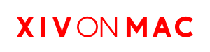

 </a> 

 </a>   
Wine Wrapper, Setup tool and alternative launcher for FFXIV on MacOS.

---

<b>The "XIV on Mac" application is a superior way of playing FFXIV on macOS.  It provides improved performance vs Square Enix's native MacOS launcher and Codeweavers Crossover.   <b>This project is 100% open source.</b>

---
<h3>Features:</h3>

- User friendly setup
- Mod support: ACT, GShade, Dalamud and more!
- Performance enhancements; Better FPS vs Native Mac launcher & Crossover, updated DXVK/MoltenVK libraries, PCAP support for ACT etc.
- User Support in our <a href="https://discord.gg/dWN5bTC4Yv">Discord.</a>
- Wine is built using https://github.com/marzent/winecx

<h6>*FPS may vary based on hardware, but in most cases FPS should be better!</h6>

---
Visit our website www.xivmac.com for details about our team and the project! 
You can read our depreciated Crossover setup guide <a href="https://github.com/seathasky/FF14-MAC_ModSupport">here.</a>
 

---

<h3>Our current staff:</h3>
<h4><a href="https://github.com/Marzent">Marzent (ウサギ)</a> (Head Developer, Technical Support) 
<a href="https://github.com/Seathasky">Seathasky</a> (Project Manager, Support) 
<a href="https://github.com/FleetAdmiralButter">FleetAdmiralButter</a> (Web Developer, Support) 
<a href="https://github.com/cbackas42">Wyldfire</a> (Contributor, Mac Development, Support) </h4>

---

  <b><i>Special Thanks to:</i></b>
<h6><a href="https://github.com/Gcenx">Gcenx</a> - for keeping wine single-handedly alive on macOS and helping out a lot with packaging our custom wine 
<a href="https://github.com/goaaats">goaaats</a> - for the amazing XIVLauncher and cross-platform efforts. 
<a href="https://github.com/redstrate">redstrate</a> - for his nativelauncher which made Dalamud injection easy to implement without .net framework 
<a href="https://github.com/tyrone-sudeium">tyrone-sudeium</a> - for his LaunchXIV App, upon which most of the login flow code was based upon. 
<a href="https://github.com/reiichi001">Franz Renatus</a> - for helping out with support and his ever useful Franzbot. 
<a href="https://www.quantcdn.io/">QuantCDN</a> - for letting us use their service free of charge to host our website and auto-update system. 
<a href="https://www.codeweavers.com/">Codeweavers</a> - for giving us permission to use their MoltenVK dylib from Crossover. 
<a href="https://github.com/zoeyrae">Zoey Ronain</a> - for her year long contribution to the project.  </h6>

And very special thanks to our wonderful community and contributors. Without your love for this project, we would not exist!

---

<b>FINAL FANTASY is a registered trademark of Square Enix Holdings Co., Ltd.</b>

